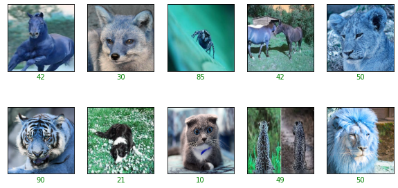
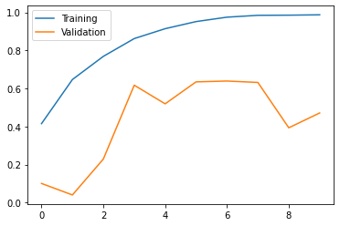

# Image Search Engine with CNN using Keras

# Task 1: Import Libraries


```python
import tensorflow as tf
import os
import pandas as pd
import numpy as np
from keras.models import Sequential
from keras.layers import Convolution2D,BatchNormalization
from keras.layers import MaxPooling2D,Dropout
from keras.layers import Flatten
from keras.layers import Dense
import cv2
from sklearn.preprocessing import LabelBinarizer
from sklearn.model_selection import train_test_split

from keras.preprocessing.image import img_to_array
import random
from keras.preprocessing import image

from matplotlib import pyplot as plt
%matplotlib inline

if not os.path.isdir('models'):
    os.mkdir('models')
    
print('TensorFlow version:', tf.__version__)
print('Is using GPU?', False if tf.config.list_physical_devices('GPU') == [] else True)
```

    TensorFlow version: 2.8.0
    Is using GPU? False
    

# Importing Dataset


```python
class Dataset(object):
    def __init__(self, data_path):
        self.data_path = data_path
        assert os.path.exists(self.data_path), 'Insert a valid path!'

        # get class list
        self.data_classes = os.listdir(self.data_path)

        # init mapping dict
        self.data_mapping = {}

        # populate mapping dict
        for c, c_name in enumerate(self.data_classes):
            temp_path = os.path.join(self.data_path, c_name)
            temp_images = os.listdir(temp_path)

            for i in temp_images:
                img_tmp = os.path.join(temp_path, i)

                if img_tmp.lower().endswith(('.jpg', '.jpeg')):
                    if c_name == 'distractor':
                        self.data_mapping[img_tmp] = -1
                    else:
                        self.data_mapping[img_tmp] = c_name

        print('Loaded {:d} from {:s} images'.format(len(self.data_mapping.keys()),
                                                    self.data_path))

    def get_data_paths(self):
        # returns a list of imgpaths and related classes
        images = []
        classes = []
        for img_path in self.data_mapping.keys():
            if img_path.lower().endswith(('.jpg', '.jpeg')):
                images.append(img_path)
                classes.append(self.data_mapping[img_path])
        return images, np.array(classes)


    def num_classes(self):
        # returns number of classes of the dataset
        return len(self.data_classes)
```

# Task 2: Preprocess Data


```python
# we get data_path
# data_path = '/content/drive/MyDrive/ML/dataset'
data_path = 'dataset_rahin'
# we define training_path
training_path = os.path.join(data_path, 'training')

# we define validation path, query and gallery
validation_path = os.path.join(data_path, 'validation')
gallery_path = os.path.join(validation_path, 'gallery')
query_path = os.path.join(validation_path, 'query')
```


```python
training_dataset = Dataset(data_path=training_path)
gallery_dataset = Dataset(data_path=gallery_path)
query_dataset = Dataset(data_path=query_path)
```

    Loaded 47986 from dataset_rahin\training images
    Loaded 295 from dataset_rahin\validation\gallery images
    Loaded 26 from dataset_rahin\validation\query images
    


```python
"""Importing the data folder and giving a shuffle"""
dataset=[]
labels=[]
random.seed(42)
imagePaths = sorted(list(os.listdir("dataset_rahin/training")))
random.shuffle(imagePaths)
```


```python
for images in imagePaths:
    path=sorted(list(os.listdir("dataset_rahin/training/"+images)))
    for i in path:
        try:
            image = cv2.imread("dataset_rahin/training/"+images+'/'+i) #using opencv to read image
#             print(images, ": ", i, ": ", image.shape)
#             image=cv2.cvtColor(image, cv2.COLOR_BGR2GRAY)
            image = cv2.resize(image, (128,128)) 
#             image = img_to_array(image) #converting image info to array
            dataset.append(image)

            l = label = images
            labels.append(l)
    #         print(l)
        except:
            print("Error with loading and resizing image", " ", images, ": ", i)
            #code to move to next frame
```


```python
"""Converting to numpay array"""
dataset = np.array(dataset, dtype="float32") / 255.0
labels = np.array(labels)

"""Here we are using LabelBinarizer to scale data because it does not need data in integer encoded form first to convert into its respective encoding"""
lb = LabelBinarizer()
labels = lb.fit_transform(labels)
```


```python
"""Splitting dataset into train and test"""

x_train,x_test,y_train,y_test=train_test_split(dataset,labels,test_size=0.3,random_state=42)
```


```python
print(y_train)
```

    [[0 0 0 ... 0 0 0]
     [0 0 0 ... 0 0 0]
     [0 0 0 ... 0 0 0]
     ...
     [0 0 0 ... 0 0 0]
     [0 0 0 ... 0 0 0]
     [0 0 0 ... 0 0 0]]
    


```python
# y_test = tf.keras.utils.to_categorical(y_test)
```


    ---------------------------------------------------------------------------

    ValueError                                Traceback (most recent call last)

    ~\AppData\Local\Temp/ipykernel_6964/3506332592.py in <module>
    ----> 1 y_test = tf.keras.utils.to_categorical(y_test)
    

    C:\ProgramData\Anaconda3\lib\site-packages\keras\utils\np_utils.py in to_categorical(y, num_classes, dtype)
         60   [0. 0. 0. 0.]
         61   """
    ---> 62   y = np.array(y, dtype='int')
         63   input_shape = y.shape
         64   if input_shape and input_shape[-1] == 1 and len(input_shape) > 1:
    

    ValueError: invalid literal for int() with base 10: 'cat'


```python
# y_train = tf.keras.utils.to_categorical(y_train)
# y_train2 = tf.keras.utils.to_categorical(np.asarray(y_train.factorize()[0]))
```


```python
def get_three_classes(x, y):
    indices_0, _ = np.where(y == 0.)
    indices_1, _ = np.where(y == 1.)
    indices_2, _ = np.where(y == 2.)

    indices = np.concatenate([indices_0, indices_1, indices_2], axis=0)
    
    x = x[indices]
    y = y[indices]
    
    count = x.shape[0]
    indices = np.random.choice(range(count), count, replace=False)
    
    x = x[indices]
    y = y[indices]
    
    y = tf.keras.utils.to_categorical(y)
    
    return x, y
```


```python
# (x_train, y_train), (x_test, y_test) = tf.keras.datasets.cifar10.load_data()
print("Train whole set:")
print(x_train.shape, y_train.shape)
print("Test whole set:")
print(x_test.shape, y_test.shape)

# x_train2, y_train2 = get_three_classes(x_train, y_train)
# x_test2, y_test2 = get_three_classes(x_test, y_test)
# print("Train subset:")
# print(x_train2.shape, y_train2.shape)
# print("Test subset:")
# print(x_test2.shape, y_test2.shape)
```

    Train whole set:
    (33625, 128, 128, 3) (33625, 98)
    Test whole set:
    (14412, 128, 128, 3) (14412, 98)
    

# Task 3: Visualize Examples


```python
class_names = ['aeroplane', 'car', 'bird']

def show_random_examples(x, y, p):
    indices = np.random.choice(range(x.shape[0]), 10, replace=False)
    
    x = x[indices]
    y = y[indices]
    p = p[indices]
    
    plt.figure(figsize=(10, 5))
    for i in range(10):
        plt.subplot(2, 5, 1 + i)
        plt.imshow(x[i])
        plt.xticks([])
        plt.yticks([])
        col = 'green' if np.argmax(y[i]) == np.argmax(p[i]) else 'red'
        plt.xlabel(np.argmax(p[i]), color=col)
    plt.show()
    
show_random_examples(x_train, y_train, y_train)
```


    

    


```python
show_random_examples(x_test, y_test, y_test)
```


    

    


# Task 4: Create Model


```python
from tensorflow.keras.layers import Conv2D, MaxPooling2D, BatchNormalization
from tensorflow.keras.layers import Dropout, Flatten, Input, Dense

def create_model():
    def add_conv_block(model, num_filters):
        model.add(Conv2D(num_filters, 3, activation='relu', padding='same'))
        model.add(BatchNormalization())
        model.add(Conv2D(num_filters, 3, activation='relu'))
        model.add(MaxPooling2D(pool_size=2))
#         model.add(Dropout(0.5))
        return model

    model = tf.keras.models.Sequential()
    model.add(Input(shape=(128, 128,3)))
    
    model = add_conv_block(model, 32)
    model = add_conv_block(model, 64)
    model = add_conv_block(model, 128)
    
    model.add(Flatten())
    model.add(Dense(98, activation='softmax'))
    
    model.compile(
        loss='categorical_crossentropy',
        optimizer='adam', metrics=['accuracy']
    )
    return model

model = create_model()
model.summary()
```

    Model: "sequential_2"
    _________________________________________________________________
     Layer (type)                Output Shape              Param #   
    =================================================================
     conv2d_12 (Conv2D)          (None, 128, 128, 32)      896       
                                                                     
     batch_normalization_6 (Batc  (None, 128, 128, 32)     128       
     hNormalization)                                                 
                                                                     
     conv2d_13 (Conv2D)          (None, 126, 126, 32)      9248      
                                                                     
     max_pooling2d_6 (MaxPooling  (None, 63, 63, 32)       0         
     2D)                                                             
                                                                     
     conv2d_14 (Conv2D)          (None, 63, 63, 64)        18496     
                                                                     
     batch_normalization_7 (Batc  (None, 63, 63, 64)       256       
     hNormalization)                                                 
                                                                     
     conv2d_15 (Conv2D)          (None, 61, 61, 64)        36928     
                                                                     
     max_pooling2d_7 (MaxPooling  (None, 30, 30, 64)       0         
     2D)                                                             
                                                                     
     conv2d_16 (Conv2D)          (None, 30, 30, 128)       73856     
                                                                     
     batch_normalization_8 (Batc  (None, 30, 30, 128)      512       
     hNormalization)                                                 
                                                                     
     conv2d_17 (Conv2D)          (None, 28, 28, 128)       147584    
                                                                     
     max_pooling2d_8 (MaxPooling  (None, 14, 14, 128)      0         
     2D)                                                             
                                                                     
     flatten_2 (Flatten)         (None, 25088)             0         
                                                                     
     dense_2 (Dense)             (None, 98)                2458722   
                                                                     
    =================================================================
    Total params: 2,746,626
    Trainable params: 2,746,178
    Non-trainable params: 448
    _________________________________________________________________
    

# Task 5: Train the Model


```python
h = model.fit(
    x_train/255., y_train,
    validation_data=(x_test/255., y_test),
    epochs=30, batch_size=128,
    callbacks=[
        tf.keras.callbacks.EarlyStopping(monitor='val_accuracy', patience=7),
        tf.keras.callbacks.ModelCheckpoint(
            'models/model_{val_accuracy:.3f}.h5',
            save_best_only=True, save_weights_only=False,
            monitor='val_accuracy'
        )
    ]
)
```

    Epoch 1/30
    263/263 [==============================] - 680s 3s/step - loss: 2.2678 - accuracy: 0.4360 - val_loss: 4.5806 - val_accuracy: 0.0325
    Epoch 2/30
    263/263 [==============================] - 676s 3s/step - loss: 1.3822 - accuracy: 0.6327 - val_loss: 4.5494 - val_accuracy: 0.0665
    Epoch 3/30
    263/263 [==============================] - 678s 3s/step - loss: 0.8783 - accuracy: 0.7437 - val_loss: 2.4069 - val_accuracy: 0.4003
    Epoch 4/30
    263/263 [==============================] - 680s 3s/step - loss: 0.4940 - accuracy: 0.8447 - val_loss: 1.8677 - val_accuracy: 0.6216
    Epoch 5/30
    263/263 [==============================] - 680s 3s/step - loss: 0.2803 - accuracy: 0.9102 - val_loss: 2.7246 - val_accuracy: 0.5283
    Epoch 6/30
    263/263 [==============================] - 682s 3s/step - loss: 0.1545 - accuracy: 0.9511 - val_loss: 2.4617 - val_accuracy: 0.5853
    Epoch 7/30
    263/263 [==============================] - 682s 3s/step - loss: 0.0853 - accuracy: 0.9747 - val_loss: 2.6135 - val_accuracy: 0.5228
    Epoch 8/30
    263/263 [==============================] - 683s 3s/step - loss: 0.0532 - accuracy: 0.9846 - val_loss: 5.0541 - val_accuracy: 0.4457
    Epoch 9/30
    263/263 [==============================] - 685s 3s/step - loss: 0.0436 - accuracy: 0.9871 - val_loss: 4.2346 - val_accuracy: 0.5033
    Epoch 10/30
    263/263 [==============================] - 686s 3s/step - loss: 0.0390 - accuracy: 0.9888 - val_loss: 3.5663 - val_accuracy: 0.6275
    Epoch 11/30
    263/263 [==============================] - 688s 3s/step - loss: 0.0677 - accuracy: 0.9780 - val_loss: 4.9199 - val_accuracy: 0.4472
    Epoch 12/30
    263/263 [==============================] - 688s 3s/step - loss: 0.0629 - accuracy: 0.9791 - val_loss: 5.1665 - val_accuracy: 0.2917
    Epoch 13/30
    263/263 [==============================] - 689s 3s/step - loss: 0.0647 - accuracy: 0.9781 - val_loss: 4.0479 - val_accuracy: 0.5776
    Epoch 14/30
    263/263 [==============================] - 689s 3s/step - loss: 0.0541 - accuracy: 0.9822 - val_loss: 3.6963 - val_accuracy: 0.6172
    Epoch 15/30
    263/263 [==============================] - 690s 3s/step - loss: 0.0515 - accuracy: 0.9826 - val_loss: 12.5570 - val_accuracy: 0.1579
    Epoch 16/30
    263/263 [==============================] - 691s 3s/step - loss: 0.0364 - accuracy: 0.9877 - val_loss: 4.6706 - val_accuracy: 0.5869
    Epoch 17/30
    263/263 [==============================] - 692s 3s/step - loss: 0.0370 - accuracy: 0.9877 - val_loss: 16.4177 - val_accuracy: 0.1304
    

# Task 6: Final Predictions


```python
accs = h.history['accuracy']
val_accs = h.history['val_accuracy']

plt.plot(range(len(accs)), accs, label='Training')
plt.plot(range(len(accs)), val_accs, label='Validation')
plt.legend()
plt.show()
```


    

    


```python
model= tf.keras.models.load_model('models/model_0.628.h5')
```


```python
preds = model.predict(x_test/255.)
```


```python
show_random_examples(x_test, y_test, preds)
```


    

    


```python

```
