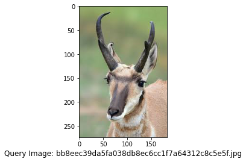
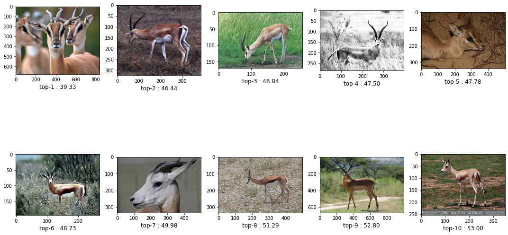
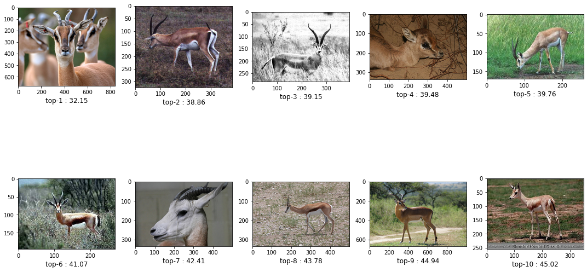
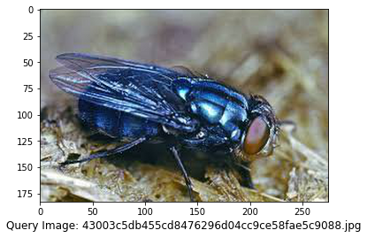
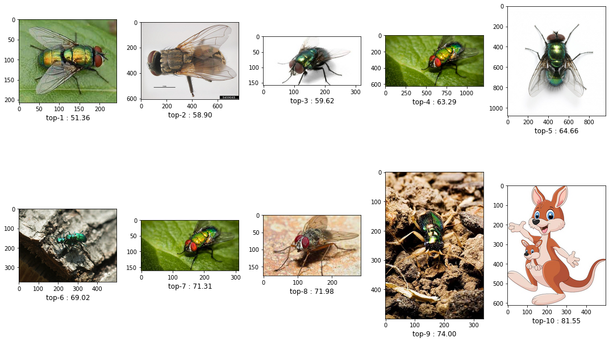
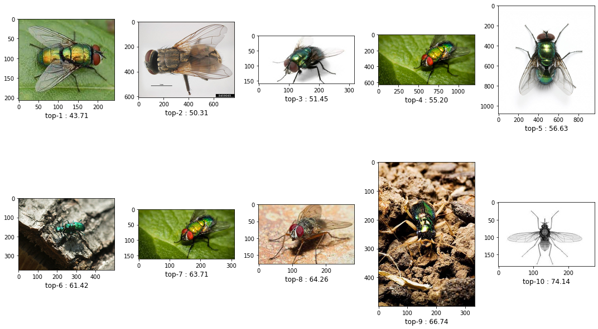
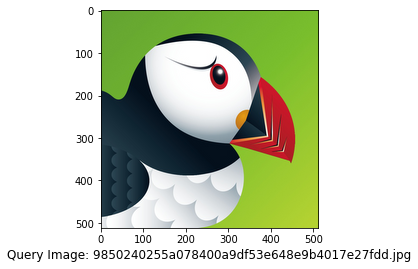
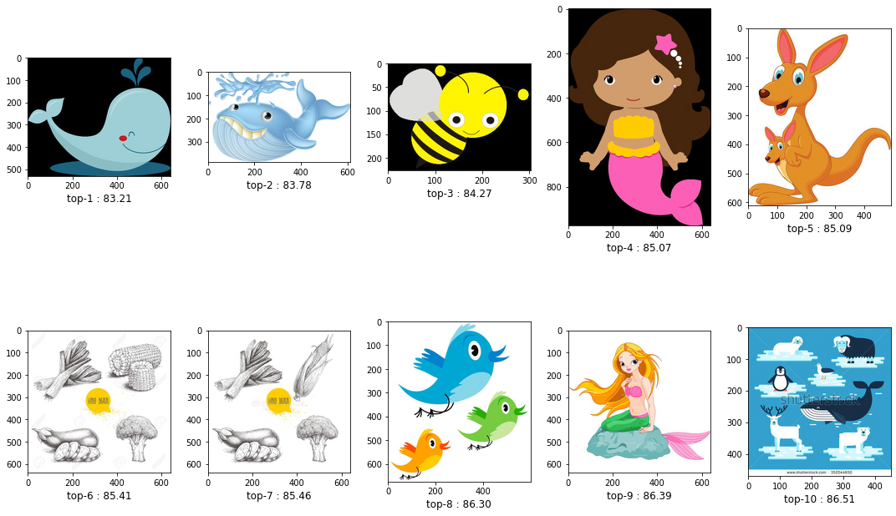
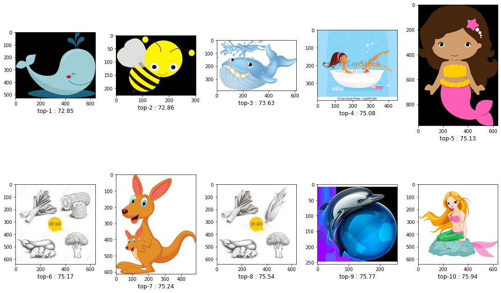

#                                            The Outliers


```python
import os
import time
import requests
import json
from datetime import datetime
#os.environ["CUDA_VISIBLE_DEVICES"] = "-1"
import numpy as np
from numpy.linalg import norm
from tqdm import tqdm
import PIL
import time
import tensorflow as tf
from tensorflow.keras.preprocessing import image
from tensorflow.keras.preprocessing.image import ImageDataGenerator

# importing models
# from tensorflow.keras.applications.resnet50 import ResNet50, preprocess_input
# from tensorflow.keras.applications.resnet_v2 import ResNet50V2, preprocess_input
# from tensorflow.keras.applications.vgg16 import VGG16, preprocess_input
# from tensorflow.keras.applications.vgg19 import VGG19, preprocess_input
from tensorflow.keras.applications.inception_v3 import InceptionV3, preprocess_input


import math
from sklearn.neighbors import NearestNeighbors
import matplotlib.pyplot as plt
import matplotlib.image as mpimg
from sklearn.decomposition import PCA

print('TensorFlow version:', tf.__version__)
print('Is using GPU?', False if tf.config.list_physical_devices('GPU') == [] else True)
print("Num GPUs Available: ", len(tf.config.list_physical_devices('GPU')))
# print(tf.config.list_physical_devices('GPU'))
```

    TensorFlow version: 2.8.0
    Is using GPU? True
    Num GPUs Available:  1
    


```python
from google.colab import drive
drive.mount('/content/drive')
```

    Drive already mounted at /content/drive; to attempt to forcibly remount, call drive.mount("/content/drive", force_remount=True).
    


```python
%%capture
!unzip /content/drive/MyDrive/ML/challenge_test_data.zip
```


```python
# Tweak these parameters as needed
query_dir = '/content/query'
root_dir = '/content'

batch_size = 64
img_size = 224

n_neighbors = 10 # for PCA
n_components = 500 # for PCA

submission_url = "http://coruscant.disi.unitn.it:3001/results/"

# use this to limit how many "query" results you want
query_limit = 3
limit_query = True

apply_pca_sim_both = False # Use Regular and PCA both similarities
apply_pca = True # Use PCA 
```


```python
start = datetime.now()

# Importing Resnet50, a pretrained model
# model = ResNet50(weights='imagenet', include_top=False,input_shape=(img_size, img_size, 3),pooling='max')

# Importing ResNet50V2, a pretrained model
# model = ResNet50V2(weights='imagenet', include_top=False,input_shape=(img_size, img_size, 3),pooling='max')

# Importing VGG16, a pretrained model
# model = VGG16(weights='imagenet', include_top=False,input_shape=(img_size, img_size, 3),pooling='max')

# Importing VGG19, a pretrained model
# model = VGG19(weights='imagenet', include_top=False,input_shape=(img_size, img_size, 3),pooling='max')

# Importing InceptionV3, a pretrained model
model = InceptionV3(weights='imagenet', include_top=False,input_shape=(img_size, img_size, 3),pooling='max')

# Trying to use our own model that was created on top of Resnet50 using Transfer Learning
# model = tf.keras.models.load_model('models/model_0.459.h5')

# Trying to use our own model that was created on top of VGG16 using Transfer Learning
# model = tf.keras.models.load_model('models/model_0.719.h5')

# DOES NOT WORK YET: Trying to use our own model that was created on CNN
# model = tf.keras.models.load_model('models/model_0.677.h5')
```

Create the keras image data generator object and extract the features for the images.


```python
#root_dir = 'dataset_rahin/final/gallery_team'
# root_dir = '/content/gallery_team'
# root_dir = '/content'


img_gen = ImageDataGenerator(preprocessing_function=preprocess_input)

datagen = img_gen.flow_from_directory('.', classes=['gallery'],
                                        target_size=(img_size, img_size),
                                        batch_size=batch_size,
                                        class_mode=None,
                                        shuffle=False)

num_images = len(datagen.filenames)
num_epochs = int(math.ceil(num_images / batch_size))

feature_list = model.predict(datagen, num_epochs,verbose = 1)

print("Num images   = ", len(datagen.classes))
print("Shape of feature_list = ", feature_list.shape)


# Get full path for all the images in our Gallery Dataset

filenames = [root_dir + '/' + s for s in datagen.filenames]
# print(filenames)

# calculating Neighbors
neighbors = NearestNeighbors(n_neighbors=n_neighbors,
                             algorithm='ball_tree',
                             metric='euclidean')
neighbors.fit(feature_list)


# calculating Neighbors for PCA
pca = PCA(n_components=n_components)
pca.fit(feature_list)
compressed_features = pca.transform(feature_list)


neighbors_pca_features = NearestNeighbors(n_neighbors=n_neighbors,
                              algorithm='ball_tree',
                              metric='euclidean').fit(compressed_features)

duration = datetime.now() - start
print("Feature Extraction completed in: ", duration)
```

    Found 6355 images belonging to 1 classes.
    100/100 [==============================] - 36s 354ms/step
    Num images   =  6355
    Shape of feature_list =  (6355, 2048)
    Feature Extraction completed in:  0:00:51.882363
    


```python
# Creating methods

def similar_images(ind, dist, res_dict, query_img_name):
    plt.figure(figsize=(15,10), facecolor='white')
    plotnumber = 1    
#     print(len(ind))

    res_dict[query_img_name] = []
    for index in ind:
        if plotnumber<=len(ind) :
            ax = plt.subplot(2,5,plotnumber)
            plt.imshow(mpimg.imread(filenames[index]), interpolation='lanczos')
#             plt.xlabel(distance[plotnumber-1],fontsize=12)
            lbl = "top-" + str(plotnumber) + " : " + str(format(dist[plotnumber-1], '.2f'))
            plt.xlabel(lbl,fontsize=12)
            plotnumber+=1

            file_name_array = filenames[index].split('/')
            res_name = file_name_array[len(file_name_array)-1]

            res_dict[query_img_name].append(res_name)
            # print("res_name: ",res_name)
    plt.tight_layout()
    plt.show()
    print('\n' * 5)

def get_similar_images(query_img_path, indices, distances, res_dict):
    print("---------- Query Image --------")
    print("")
    
    plt.figure()
    plt.imshow(mpimg.imread(query_img_path), interpolation='lanczos')
    # plt.xlabel(img_path.split('.')[0] + '_Original Image',fontsize=20)
    
    file_name_array = query_img_path.split('/')
    query_img_name = file_name_array[len(file_name_array)-1]

    plt.xlabel('Query Image: ' + query_img_name,fontsize=12)
    plt.show()
    print()
    print('---------- Similar Images --------')
    print()
    similar_images(indices[0], distances[0], res_dict, query_img_name)
    
def get_simalar_images_pca(query_img_path, pca_indices, pca_distances, res_dict):
    print("---------- Query Image --------")
    print("")

    plt.figure()
    plt.imshow(mpimg.imread(query_img_path), interpolation='lanczos')
    # plt.xlabel(query_img_path.split('/')[3] + '_Original Image',fontsize=20)

    file_name_array = query_img_path.split('/')
    query_img_name = file_name_array[len(file_name_array)-1]

    plt.xlabel('Query Image: ' + query_img_name,fontsize=12)
    plt.show()
    print()
    print('---------- Similar Images after PCA --------')
    print()
    similar_images(pca_indices[0], pca_distances[0], res_dict, query_img_name)

def submit(results, url=submission_url):
    res = json.dumps(results)
    response = requests.post(url, res)
    try:
        result = json.loads(response.text)
        print(f"accuracy is {result['results']}")
    except json.JSONDecodeError:
        print(f"ERROR: {response.text}")
```


```python
# query_img_path = 'dataset_rahin/final/query/2.png'
# query_dir = 'dataset_rahin/final/query_team/'
# query_dir = '/content/query'


# # use this to limit the loop to specific query count
idx_run = 0
# query_limit = 10


mydata = dict()
mydata['groupname'] = "The Outliers"

res = dict()

for filename in os.listdir(query_dir):

    # use this to limit the loop to specific query count
    if idx_run==query_limit and limit_query:
      break


    query_img_path = os.path.join(query_dir, filename)
    # checking if it is a file
    if os.path.isfile(query_img_path) and query_img_path.lower().endswith(('.jpg', '.jpeg', 'png')):
#         print(query_img_path)
#         plt.imshow(plt.imread(query_img_path))
#         plt.xlabel('Query Image: ' + query_img_path.split('/')[3],fontsize=12)
#         plt.show()

        input_shape = (img_size, img_size, 3)
        img = image.load_img(query_img_path, target_size=(input_shape[0], input_shape[1]))
        img_array = image.img_to_array(img)
        expanded_img_array = np.expand_dims(img_array, axis=0)
        preprocessed_img = preprocess_input(expanded_img_array)

        test_img_features = model.predict(preprocessed_img, batch_size=1)

        distances, indices = neighbors.kneighbors(test_img_features)

        # for dist in _:
        #     print(dist)

#         print(indices.shape)
        
        if apply_pca_sim_both:
          # Get Similar Images
          get_similar_images(query_img_path, indices, distances, res)

          # Get Similar Images after applying PCA

          test_img_compressed = pca.transform(test_img_features)
          pca_distances, pca_indices = neighbors_pca_features.kneighbors(test_img_compressed)
          # print(indices.shape)

          get_simalar_images_pca(query_img_path=query_img_path, pca_indices=pca_indices, pca_distances=pca_distances, res_dict=res)
          
        elif apply_pca:
          # Get Similar Images after applying PCA

          test_img_compressed = pca.transform(test_img_features)
          pca_distances, pca_indices = neighbors_pca_features.kneighbors(test_img_compressed)
          # print(indices.shape)

          get_simalar_images_pca(query_img_path=query_img_path, pca_indices=pca_indices, pca_distances=pca_distances, res_dict=res)
        else:
          # Get Similar Images
          get_similar_images(query_img_path, indices, distances, res)
        
        # use this to limit the loop to specific query count
        idx_run = idx_run + 1
        
#         TODO implement server api to get results

```

    ---------- Query Image --------
    
    


    

    


    
    ---------- Similar Images --------
    
    


    

    


    
    
    
    
    
    
    ---------- Query Image --------
    
    


    

    


    
    ---------- Similar Images after PCA --------
    
    


    

    


    
    
    
    
    
    
    ---------- Query Image --------
    
    


    

    


    
    ---------- Similar Images --------
    
    


    

    


    
    
    
    
    
    
    ---------- Query Image --------
    
    


    

    


    
    ---------- Similar Images after PCA --------
    
    


    

    


    
    
    
    
    
    
    ---------- Query Image --------
    
    


    

    


    
    ---------- Similar Images --------
    
    


    

    


    
    
    
    
    
    
    ---------- Query Image --------
    
    


    

    


    
    ---------- Similar Images after PCA --------
    
    


    

    


    
    
    
    
    
    
    


```python
# import json
# print(json.dumps(res, indent=4))

# print(json.dumps(res["bb8eec39da5fa038db8ec6cc1f7a64312c8c5e5f.jpg"], indent=4))

mydata["images"] = res

print(json.dumps(mydata, indent=4))
# submit(mydata)

```

    {
        "groupname": "The Outliers",
        "images": {
            "bb8eec39da5fa038db8ec6cc1f7a64312c8c5e5f.jpg": [
                "67a7485bc2bfa9dd50173ae6fd1188303f5938d2.jpg",
                "bd1c944cbc7a8db3b0f929ae3398d5681559689b.jpg",
                "42030db7df093744912709d4b08757e20a3a7bc2.jpg",
                "817ef8fbecd483d8ea426bb32900d53c77006fad.jpg",
                "f4674decc4a616dcd4b34a913148e7f45465ddf8.jpg",
                "725917cc2e378742906a156c33b75f812df3ae8f.jpg",
                "967370b8d81249b80975be5ed25b0cc8d9dc793a.jpg",
                "c242d21fd8b8a123b59c52385349a2972a07a5cd.jpg",
                "6ce7e8dda2d5b5dd8e5029c070e178094aa1cf81.jpg",
                "21a2ed48cdba5ccaee07bf9af57d617bedc1cac6.jpg"
            ],
            "43003c5db455cd8476296d04cc9ce58fae5c9088.jpg": [
                "de12af05ffa2938be6e2c7ffe47e8af8b53a9385.jpg",
                "262fc77eb11a5de8637e382a06764123b1dbeea1.jpg",
                "1d191552cdc8632317ebb3fe8187d78d5a608028.jpg",
                "1250ed117728aa6bc48138615e1a9f56697bcf9c.jpg",
                "a6f40843469fb8dfe18556f9b5c63519b7325534.jpg",
                "52165fc215567ab051b4eb133454772c71e33e29.jpg",
                "faf07b7d041465c32f7ce1894ced3126d91cdf82.jpg",
                "5be7d247985fe40568bc93d7634505c0e5bd613d.jpg",
                "66ab702a3de1ce96f5eb00bb9e93dc09304726d3.jpg",
                "e5937a6b505df5cf07f47780cdb99b6e161e7908.jpg"
            ],
            "9850240255a078400a9df53e648e9b4017e27fdd.jpg": [
                "a569ac0bb22ffe8b0357269bf66f54ecabd20895.jpg",
                "df89458c37e16d0668f28c615bf938c8741ae010.jpg",
                "7dddabe7aa9cae918371d50717b5929a59211934.jpg",
                "92d67eeb36c9ca786bd76fd9058a12e3dc37e46d.jpg",
                "b387374d4e1ed058056e58681a0fb3fef042301d.jpg",
                "1475e80d34addc3522c1538cf87e1773eda7f55b.jpg",
                "f278a7e97040b27d40e3d86e14729745fd5523de.jpg",
                "2d8b601c9a0dbc727a2d647156e87b62c9978846.jpg",
                "8c2ace8712072e86ca95206fa441f22ea483bb2b.jpg",
                "3fb0095a2697c2c56c83724d069c93db23ee5a20.jpg"
            ],
            "aa0ffa45a8d82f8c728a34fac92a7d425eaf1fe5.jpg": [
                "6a80d557dd889a39bdc110b5a6f0f5726188c5c9.jpg",
                "5db36f85ebba02a4ae22fc2b22650d2da41541f8.jpg",
                "b92701b1c0b819d2fafd418cec09e36289778471.jpg",
                "1844d42cd34e22441345a6619c09010f9a0cb11b.jpg",
                "80de9c06e7d04317700def6ce057131a5229c1a6.jpg",
                "3d8e8e5eece1b3784e6c140d65a58416874c3d7b.jpg",
                "b387374d4e1ed058056e58681a0fb3fef042301d.jpg",
                "2604283af21e6d915d0150ccd29cfe50a60185a7.jpg",
                "984ab7f92616dc78684b39cc2544a9b8fc4c506d.jpg",
                "ff2ff8f7bd59a3230e60f9ac46db0a1ed3c842a7.jpg"
            ],
            "6b3aee4bdb8c8ad996e93e0509e03299e56ab1d4.jpg": [
                "a906661f6c0b7ec9ccd9447eaa8f3648b59bd59e.jpg",
                "50c3b96636f1c658dd51ed1065dd8be4f8374ae9.jpg",
                "bbc968b450ad016155c02ed84afd24109303aee4.jpg",
                "cd55313c7338001e83c592421105a7d8425aea2a.jpg",
                "ad0d7775cc6b31757c7b950d76b895386d16d7a9.jpg",
                "809f5de42f1044c6f28073a2caa6efafc086546c.jpg",
                "704f9dacd50d29c5af9a78d680bff7fdf4d60b52.jpg",
                "c143d75894eb0c08c48c8a7b7bcd14252d378332.jpg",
                "9fb8f5853ece1f493624e0b2643d44c121c5a39b.jpg",
                "f9b68149a1712fc04d228c50e17e66c29c5965c8.jpg"
            ],
            "d9ddd84712108f0c8e8657c48960840f13ca7980.jpg": [
                "a88301ebe921afdab88193ef1da31d1fde7513ac.jpg",
                "414c1a857debc0f241352856a1e429563c706904.jpg",
                "ba87b98e1025267fdda5205c5e26ef275ec0a650.jpg",
                "30f94f5dc11d964271777c863e28b82c96455bbe.jpg",
                "35ae302631461e98bcef21358cac2c59811e4023.jpg",
                "09dfa20afe1a354a08911eef91b4218e079efed9.jpg",
                "22b32d953db1c0d77e69d06ac15a38ca622ec9b7.jpg",
                "55aaffe4f69081e036899b2e2b3b08969b16c6e7.jpg",
                "c28ccbb202ae02a8763c9d5ae562b3ad5861537e.jpg",
                "fe687df35ade197dfa014466b03a815c8e7a3ff7.jpg"
            ],
            "ce1d6a96ae2bbd7cb82493447e5d15ac452139ed.jpg": [
                "0f1b581406f57d8cc66acf95f2d1fe582dd8c200.jpg",
                "d4f56a2757fe7035e298086dc07996749dae4714.jpg",
                "e9fd47e433901cf4a9141706ee0f836d56c00379.jpg",
                "0d3bb3dfad976cd5080a013483df6792c1c281ae.jpg",
                "0354c408554f47859ea29857df0aecfab586051f.jpg",
                "9e41f73240721c272ae6d414963d5208759e68f7.jpg",
                "34f80641f97417079af9b868977d83bb1fc6dfe9.jpg",
                "26d0c1ce947f317f68fb2fee338a70048730bcbd.jpg",
                "c05083ac099715e7d69e3db3a039fa1bd5d7da5e.jpg",
                "21e0e0207bb68d4e6032b90afa05a840dc9fb6b2.jpg"
            ],
            "75dd73521d157440c11c15cadcaac043f0deed04.jpg": [
                "2eabad92004a48f8c13c9886a7723ab89f269e0c.jpg",
                "297cc434b8baf4c3fdd6ce1b99c3faea6c9229e3.jpg",
                "3d8e8e5eece1b3784e6c140d65a58416874c3d7b.jpg",
                "90995450c6642a49e53aecc6c1ef869eabc20626.jpg",
                "2e07ae22241043e62284ca48746c7195d4bb50c7.jpg",
                "635d2a09cef4c1da2fecf8711bcbc487b6497d62.jpg",
                "61d671c41e8582a122c65329f915ae3d5662da83.jpg",
                "a71c48c7f1891dce72bf337d62a5e3a13bfed293.jpg",
                "b8e6e184095c359553ba0a354d718fc8b2c84448.jpg",
                "9beccde204b3ab3a7eedd548fedafef9ef93d47f.jpg"
            ],
            "107a5df0afa0c36f272ea7d01f14be2a66fb6b39.jpg": [
                "7beedfe397170857e778318a615d19297d8e5c51.jpg",
                "4be9c2f678bb0e81623dcb17f5dfc06dec6d29b4.jpg",
                "8fd0d7d3a6f8a5881895e079023828c3b8bb3f00.jpg",
                "5597995de0cea07ef81c1db50162920a0a1af5a0.jpg",
                "597778077c7121e5ff2c86bb81107ec2f59798cc.jpg",
                "a220e83ce078ddc4cdce932eaeea788b8c5d9ca5.jpg",
                "6de5d40be796e1fa9dee9c0366a4ed16b420b847.jpg",
                "bfca3322ce9a2f66208ad94c5f8e05fd3e63b9ae.jpg",
                "7dcbe5016cf3aa615641370a3250411770b75aba.jpg",
                "dbd50b480ccdcc3678c609e9d07701788d59e83e.jpg"
            ],
            "3ff3f6687e676164720e20202ca9079cf6380c89.jpg": [
                "97d1099f1fff953162ae5031bc2f7c75b68867b0.jpg",
                "c7580a57ee3490be5d9445b8c5620def43bc69c7.jpg",
                "a09e47063c253c7fe04245d193da70c4df577cc8.jpg",
                "f9cb776b919362e53f2c0e167f1528f143dffe2f.jpg",
                "35a95f05fcbb7f6f4c071e71c9ac182d848ed38b.jpg",
                "4c7ca49f8b5c4fdd4b86199f5ad9cacbfe351395.jpg",
                "6999876cc5f9ec22c308127f4bd6c55a04281324.jpg",
                "ff12d11294af68db27cb265a0eca76eef9f84569.jpg",
                "75cafa1fc823e35b66ebac11d0352dbc77c3253d.jpg",
                "e0325ae5109ca04cf18ff45623666623b67d9369.jpg"
            ]
        }
    }
    


```python

```
